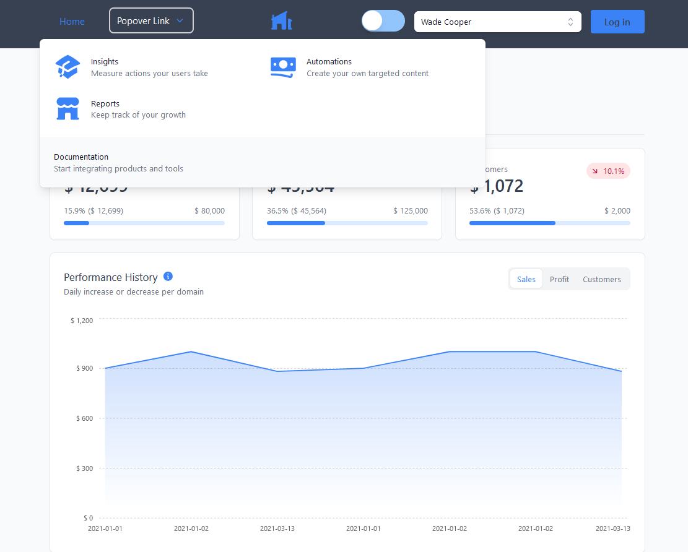
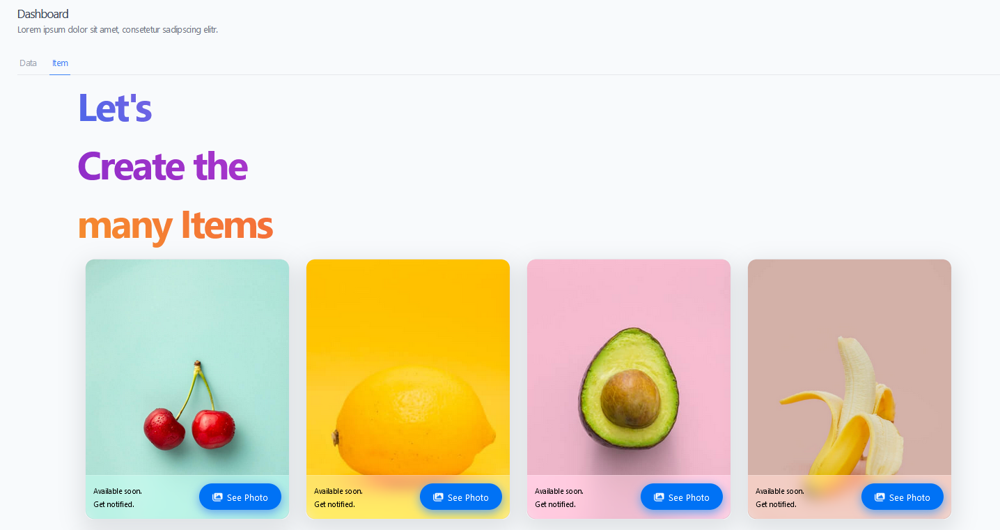
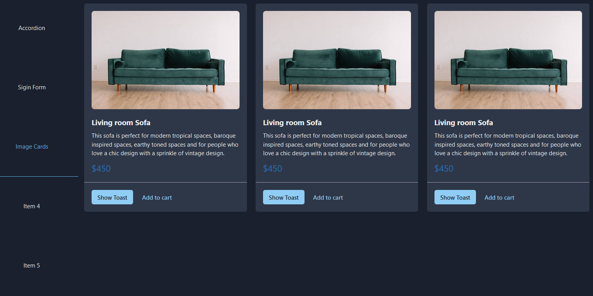

# Dashboard React.js

Simple Layout with React, Chakra UI(with Icons), Emotion, Tailwind and Postcss.
and Create other Simple Layout with Headless UI, Tremor, NextUI, ReactJSS, Font Awesome and Hero Icons.

## [Demo Link](https://alibagheri2079.github.io/dashboard-reactjs/)





## Tech Stack

**Client:** React, Chakra UI, Next UI, Headless UI, Tremor, Emotion, ReactJSS, TailwindCSS, Postcss with Sass,
Font Awesome and Hero Icons.

## Features

- Yarn, Vite
- Rome, Stylelint Husky and Lint-staged
- Github flow
- Github Page

## Run Locally

Clone the project

```bash
  git clone https://github.com/AliBagheri2079/dashboard-reactjs.git


```

Go to the project directory

```bash
  cd dashboard-reactjs


```

Install dependencies

```bash
  yarn install


```

Start the server

```bash
  yarn run dev


```

## Deployment

To deploy this project run

```bash
  npm run deploy


```

## 🚀 About Me

I'm Ali Bagheri. Learning about 3 years on Frontend Development Position ...

## 🔗 Links

[](https://github.com/AliBagheri2079)

[](https://www.linkedin.com/in/alibagheri2079/)

[](https://twitter.com/AliBagheri2079)
